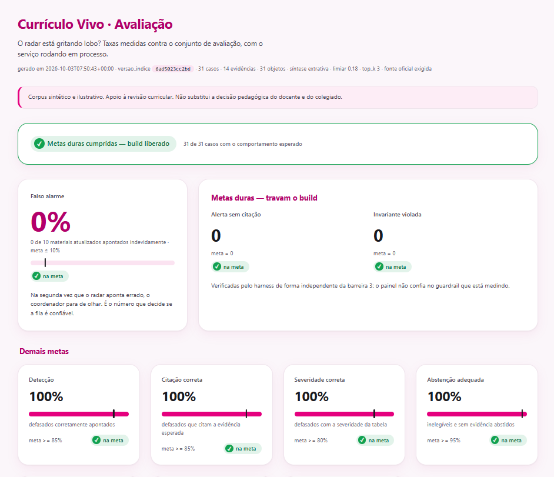
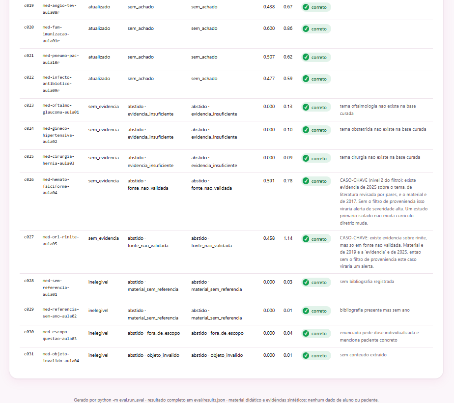
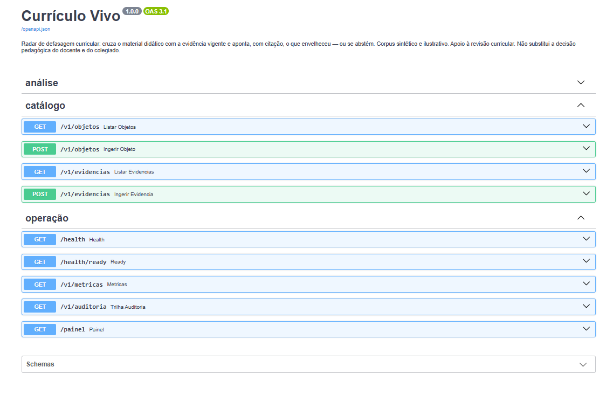

# Currículo Vivo

[](https://github.com/melizamaia/curriculo-vivo/actions/workflows/ci.yml)
[](https://melizamaia.github.io/curriculo-vivo/)


**Radar de defasagem curricular para educação médica: cruza o material didático
com a evidência vigente e aponta, com citação, o que envelheceu — e se cala
quando não tem base para apontar.**

> ⚠️ **Corpus sintético.** Todas as evidências e todos os objetos de
> aprendizagem deste repositório são fictícios e marcados com
> `exemplo_ilustrativo: true`. Não reproduzem protocolo, diretriz ou material
> didático real e não servem como referência clínica ou pedagógica. Detalhes em
> [Aviso](#aviso).


*O radar do coordenador, ordenado por severidade.*


*O painel de avaliação: falso alarme em 0%.*


*c026 e c027: os dois níveis do filtro de proveniência.*


*A API documentada em OpenAPI.*

Galeria completa, com as sete capturas: [docs/capturas.md](docs/capturas.md).

## O problema

Uma aula de sepse continua citando o protocolo de 2019 porque ninguém foi
avisado de que saiu atualização em 2024, e isso só aparece depois, como questão
errada em simulado ou como revisão curricular às pressas. Um LLM genérico não
resolve: ele não diz de onde tirou a informação, e falso alarme custa mais que
alerta perdido, porque o coordenador que é enganado duas vezes para de olhar.

O Currículo Vivo compara a data da referência que cada material usa com a
evidência vigente numa base curada, e emite **alerta com citação obrigatória ou
abstenção explícita**. Nunca um alerta sem fonte.

## Resultado da avaliação

`make eval` roda 31 casos rotulados em quatro classes e gera um painel
autocontido em `dashboard/index.html` (também servido em `/painel`).

| Métrica | Meta | Resultado |
| --- | --- | --- |
| **Falso alarme** (material atualizado apontado como defasado) | ≤ 10% | **0%** |
| Detecção (material defasado apontado) | ≥ 85% | 100% |
| Citação correta (a evidência esperada foi a citada) | ≥ 85% | 100% |
| Severidade correta | ≥ 80% | 100% |
| Abstenção adequada (inelegível ou sem evidência) | ≥ 95% | 100% |
| Motivo de abstenção correto | ≥ 90% | 100% |
| **Alerta sem citação** | = 0 (dura) | **0** |
| **Invariante de contrato violada** | = 0 (dura) | **0** |
| Latência p50 / p95 por análise | p95 < 500 ms | 0,7 / 1,1 ms |
| Custo por análise | — | US$ 0 (síntese extrativa, sem LLM) |

Como ler esses números:

- **100% não é prova de generalização.** O corpus foi calibrado de trás para
  frente a partir da tabela de severidade, de modo a cobrir cada comportamento
  e as fronteiras (gap de exatamente 12 e 24 meses). O que o eval prova é que o
  mecanismo faz o que promete e que as invariantes se sustentam. Com dados
  reais, o número a vigiar é o falso alarme.
- **As metas duras travam o pipeline.** `alerta_sem_citacao` ou
  `invariante_violada` diferente de zero faz `run_eval` sair com código ≠ 0, e
  o `docker build` roda o eval, ou seja, uma imagem que alerta sem fonte não chega
  a ser construída.

## Como rodar

Pré-requisitos: Python 3.12 com `venv` (no Debian/Ubuntu,
`sudo apt install python3-venv`) e `make`. Nada mais: sem Mongo, sem Kafka,
sem chave de API.

```bash
git clone https://github.com/melizamaia/curriculo-vivo.git && cd curriculo-vivo
make install
make run          # API em http://localhost:8000/docs
```

Em outro terminal:

```bash
make demo         # roteiro da apresentação: radar, 5 casos, auditoria, métricas
make test         # 214 testes
make eval         # harness de avaliação + painel em dashboard/index.html
```

### Front (radar do coordenador)

Uma tela em Next.js (App Router) + React + TypeScript, em `web/`, que consome
`GET /v1/defasagens`. Requer Node 24 (`web/.nvmrc`). Com a API no ar, em
outro terminal:

```bash
make front        # http://localhost:5173 (instala as dependências na 1ª vez)
```

Ou, sem o Makefile: `cd web && npm install && npm run dev`. A API libera CORS
para `http://localhost:5173` por padrão. Para outra origem, use
`CORS_ORIGINS=http://a:1,http://b:2` no ambiente (essa variável não é lida do `.env`); vazio desliga o CORS. O front aponta
para `http://localhost:8000`; para outra URL, use `VITE_API_URL=... npm run dev`
(modelo em `web/.env.example`). Os nomes `VITE_*` vêm de antes da migração
para Next e foram mantidos; o `web/next.config.ts` os expõe ao navegador.

### BFF NestJS (opcional)

Em `bff/`, um BFF mínimo em NestJS (um módulo, um controller, um service) que
fecha o desenho da [arquitetura](#arquitetura): `GET /api/radar` repassa
`GET /v1/defasagens` do FastAPI (mesmo contrato, mesmos filtros) e devolve ao
front. Sem auth, sem banco, sem cache.

**O BFF é opcional.** O front só passa por ele quando `VITE_BFF_URL` está
definida, e mesmo assim, se o BFF não responder, cai sozinho para o FastAPI em
`VITE_API_URL`. A tela mostra por onde o radar veio (`via BFF` ou
`via FastAPI`). Derrubar o BFF no meio da demo não derruba o radar.

Ordem de subida, um terminal por serviço:

```bash
make run                                          # 1. FastAPI em :8000 (obrigatório)
make bff                                          # 2. BFF em :3001 (opcional)
VITE_BFF_URL=http://localhost:3001 make front     # 3. front em :5173, via BFF
```

Sem o BFF, pule o passo 2 e rode só `make front`. Variáveis do BFF:
`FASTAPI_URL` (padrão `http://localhost:8000`), `PORT` (padrão `3001`;
no Makefile, `PORTA_BFF`) e `CORS_ORIGINS` (padrão
`http://localhost:5173,http://localhost:3000`).

`make demo` não precisa da API no ar (sobe em processo). Para rodar contra a
API: `make demo URL=http://localhost:8000`.

### Stack completa (API + worker + Mongo + Kafka)

Requer Docker com o plugin `compose`.

```bash
docker compose up --build    # ou: make up
make evento                  # publica uma evidência em evidencia.nova e espera o worker
```

O `make evento` (no host, depois do `make install`) publica uma evidência
sintética de oftalmologia, tema que a base curada não cobre, e imprime o
`evidencia.indexada` que o worker devolve. Para a API passar a usá-la:
`docker compose restart api` (veja [Limitações](#limitações-conhecidas)).

Todos os alvos: `make help`.

### Exemplos de chamada

```bash
# o radar: a fila do coordenador, ordenada por severidade
curl -s localhost:8000/v1/defasagens | jq '{total_objetos, objetos_com_defasagem, por_severidade, abstencoes}'

# objeto defasado → alerta alto, com citação (fonte, URL, data, nível de evidência)
curl -s localhost:8000/v1/analises -H 'content-type: application/json' \
  -d '{"objeto_id":"med-clin-sepse-aula07"}' | jq

# objeto sem referência datada → abstenção, não chute
curl -s localhost:8000/v1/analises -H 'content-type: application/json' \
  -d '{"objeto_id":"med-sem-referencia-aula01"}' | jq '{status, motivo_abstencao}'
```

## Arquitetura

O que existe neste repositório:

```
┌──────────────────────────────────────────────────────────────────────┐
│          Next.js · App Router (web/)  ·  radar do coordenador        │
└──────────────┬───────────────────────────────────────┬───────────────┘
               │ GET /api/radar                        ┆ direto, sem BFF
               │ (se VITE_BFF_URL)                     ┆ ou se ele cair
┌──────────────▼───────────────────┐                   ┆
│  BFF NestJS (bff/) · opcional    │                   ┆
│  GET /api/radar                  │                   ┆
└──────────────┬───────────────────┘                   ┆
               │ GET /v1/defasagens                    ┆
┌──────────────▼───────────────────────────────────────▼───────────────┐
│  FastAPI (app/)                                                      │
│  POST /v1/analises · GET /v1/defasagens (radar)                      │
│  POST /v1/objetos /evidencias · GET /v1/metricas /auditoria          │
└──────────────┬───────────────────────────────────────────────────────┘
               │
┌──────────────▼───────────────────────────────────────────────────────┐
│  MongoDB (auditoria, evidências; sem ele, memória)                   │
│  + Kafka: evidencia.nova → evidencia.indexada → defasagem.detectada  │
└──────────────┬───────────────────────────────────────────────────────┘
               │
  ┌────────────▼─────────────┐
  │ Worker Python de ingestão│
  │ ETL + validação + índice │
  └──────────────────────────┘
```

Este repositório é o lado Python (a API FastAPI, o worker de ingestão e o
harness de avaliação) mais duas camadas finas que fecham o caminho de ponta a
ponta como prova de contrato: o front Next.js e um BFF NestJS que só agrega o
radar. O front funciona com ou sem o BFF. Ficam de fora o NestJS de domínio
(cursos, turmas, docentes) e a camada de plataforma do PRD (Kubernetes,
GitLab CI/CD, OpenTelemetry); o diagrama-alvo completo está na seção 4 do
[PRD](PRD.md).

### O caminho de uma análise

Cada objeto passa por quatro barreiras, e cada uma tem um motivo de abstenção
próprio e testado:

| Barreira | Quando | Abstém ou descarta se… |
| --- | --- | --- |
| 1. Escopo | antes de buscar | não há referência datada, o texto pede dose individualizada, ou menciona paciente/aluno identificado |
| 2. Confiança e proveniência | depois de buscar | similaridade abaixo do limiar, ou só há fonte que não é órgão oficial nem diretriz de sociedade |
| 3. Validação do achado | antes de responder | o alerta não cita evidência, cita marcador inexistente, ou a evidência não é mais nova que a referência |
| 4. Alertas | junto da resposta | (não bloqueia) base ilustrativa, confiança no limiar, objeto sem revisão há anos |

Se a barreira 3 descartar tudo, o status vira `abstido` com
`alerta_descartado`, nunca `sem_achado`: o descarte indica regressão no
gerador de justificativa e não pode aparecer como número saudável no painel.

## Decisões de arquitetura

Cada decisão tem custo. A coluna da direita diz qual é.

| # | Decisão | Em vez de | Por quê | O que se paga |
| --- | --- | --- | --- | --- |
| 1 | TF-IDF esparso + cosseno | Embeddings / vector DB | Determinístico (mesmo objeto → mesmo alerta, requisito de auditoria), custo zero, sobe offline | Não entende sinônimos. Mitigado com filtro por tema em vocabulário controlado; `Retriever.buscar` isola a troca |
| 2 | Comparar **datas** de referência | Diff semântico do conteúdo | "Sua aula cita 2019, existe 2024" é verificável e defensável em colegiado; "o texto divergiu 0,72" não é | Não pega material com referência recente que ensina errado, nem referência velha cujo conteúdo segue válido |
| 3 | Severidade por regra em tabela | Score de modelo | O coordenador entende por que algo é alto; a regra é versionada e testada | Fronteira rígida: 23 meses é média, 24 é alta |
| 4 | Justificativa extrativa; LLM opcional | LLM sempre | A demo não depende de rede nem de chave. Com LLM, a saída passa pela mesma barreira 3 | Texto menos fluido no modo padrão |
| 5 | Ingestão assíncrona por evento | Ingestão no request | Extração de documento é cara e variável; fora do request, o p95 fica previsível | Consistência eventual: evidência nova não vale no mesmo instante |
| 6 | Guardrail em 4 barreiras separadas | Uma validação no fim | Cada abstenção tem motivo próprio e auditável | Mais código e mais caminhos a testar |
| 7 | Auditoria guarda **hash** do objeto | Texto integral | Reconstrói a análise sem duplicar conteúdo didático proprietário no log | Para reler o material é preciso o catálogo versionado |
| 8 | Fallback em memória para Mongo e Kafka | Falhar no boot | Infra fora do ar degrada observabilidade, não a análise | Em memória, a trilha some no restart. Em produção o trade-off se inverte |
| 9 | Commit manual de offset + idempotência por hash | Auto-commit | O offset só avança depois de indexar e publicar; a reentrega é reconhecida pelo hash | Entrega at-least-once: o consumidor de `evidencia.indexada` precisa tolerar duplicata |

A decisão de produto mais importante não é técnica: **literatura revisada por
pares não dispara alerta sozinha.** Um estudo primário isolado é hipótese, não
consenso; o que muda currículo é diretriz e protocolo. Aceitar o último paper
como gatilho seria construir a máquina de alarme falso que o produto existe
para evitar. O eval tem um caso só para isso (`c026`: material de 2017,
artigo revisado de 2025, resultado esperado é abstenção).

## Worker de ingestão

`app/workers/ingestor.py` consome `evidencia.nova` e publica
`evidencia.indexada`. Para cada mensagem:

1. **Valida a proveniência.** Exige `fonte`, `fonte_tipo` e `publicado_em`
   explícitos (o default do modelo não é aceito: seria inventar proveniência),
   URL para fontes que podem sustentar alerta, data não futura, e `trecho_id`
   único e prefixado pelo `doc_id`. Reprovada → `evidencia.rejeitada`, com o
   motivo, e o offset é confirmado para que a mensagem malformada não trave a
   partição.
2. **Idempotência.** O mesmo conteúdo (SHA-256 canônico) para o mesmo `doc_id`
   é ignorado. Reenviar a base curada inteira não muda nada.
3. Reindexa → publica → persiste no Mongo → marca o hash → **confirma o
   offset**. O hash só é marcado no fim: se o processo cair no meio, a
   reentrega reprocessa em vez de ser tomada por duplicata.

Fonte `nao_validada` é **aceita** na ingestão. Quem a impede de sustentar
alerta é a barreira 2, na hora da análise, então a política de fonte mora num
lugar só.

A classe `Ingestor` não conhece o Kafka: recebe um publicador e um consumidor
quaisquer. `tests/test_ingestor.py` prova a ordem publicar → commit, que falha
no meio não confirma offset, e que restart não perde evidência, tudo sem
broker.

## Limitações conhecidas

- **Propagação para a API só no boot.** A API carrega a base curada mais o
  que o worker já gravou no Mongo quando sobe. Evidência ingerida depois só
  passa a valer com restart da API. O próximo passo é a API consumir
  `evidencia.indexada` e recarregar.
- **`defasagem.detectada` ainda não é publicado.** O tópico existe e o
  contrato está em `app/models.py`, mas o radar não emite o evento.
- **Índice em memória por processo**, reconstruído por inteiro a cada
  ingestão. Serve para dezenas ou centenas de documentos; acima de ~100 mil trechos
  o caminho é um índice vetorial gerenciado, atrás da mesma interface.
- **Sem autenticação nem multi-tenancy** (fora do escopo do MVP).

## Estrutura

```
app/
  core/          texto, retriever, detector, guardrail, justificativa, audit, servico
  api/           rotas de análise, catálogo e operação
  repositories/  auditoria, catálogo e evidências ingeridas (Mongo + fallback)
  workers/       ingestor Kafka
data/            corpus sintético (evidências curadas + catálogo de material)
eval/            dataset rotulado, harness e template do painel
web/             front Next.js: o radar do coordenador (uma tela)
bff/             BFF NestJS opcional: GET /api/radar → GET /v1/defasagens
scripts/         gerador do corpus, roteiro da demo, publicador de evento
tests/           214 testes
PRD.md           requisitos, contratos e regras completas
```

Configuração: todas as variáveis estão em `.env.example`, e nenhuma é
obrigatória. O log de boot informa em que modo o serviço entrou (Mongo ou
memória, extrativa ou LLM).

## Aviso

Este é um projeto de portfólio, um estudo independente. O corpus de evidência e
o material didático são **sintéticos e ilustrativos**: não reproduzem
protocolos, diretrizes, bulas ou material didático real e não devem ser usados
como referência clínica ou pedagógica. O serviço apoia a revisão curricular e
não substitui a decisão pedagógica do docente e do colegiado, nem o
julgamento clínico. Nenhum dado de aluno ou de paciente é recebido, processado
ou armazenado.

Licença: [MIT](LICENSE).
