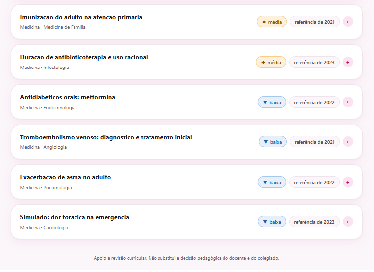
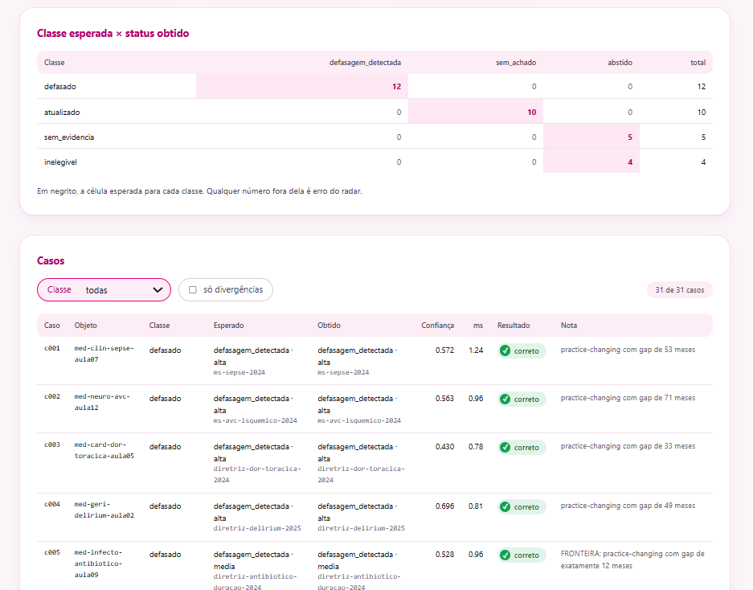
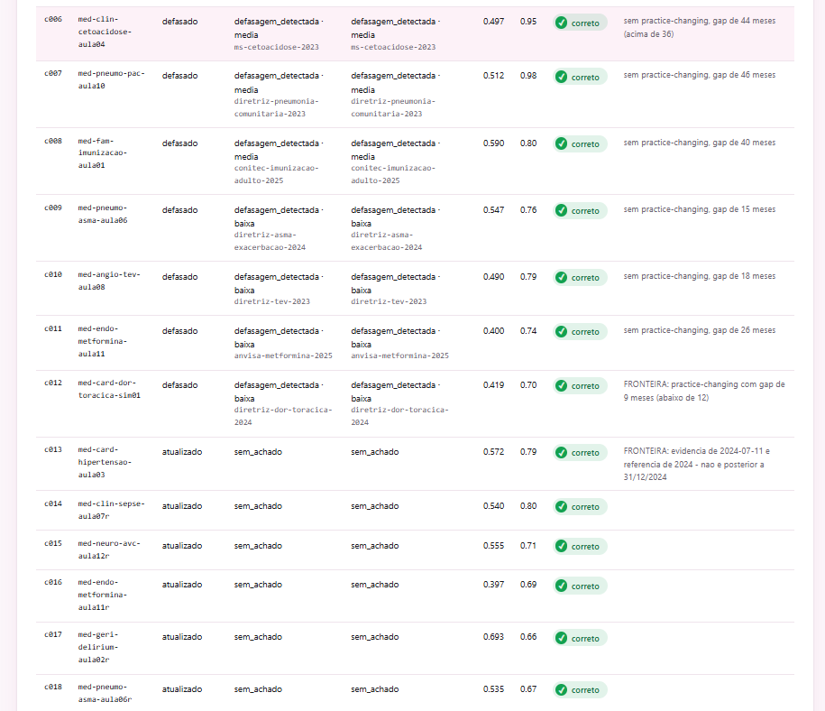

# Capturas

Todas as telas rodam sobre o corpus sintético do repositório. Voltar ao
[README](../README.md).

## 1. Radar do coordenador: topo

Os contadores (31 objetos analisados, 12 com defasagem, 4 de cada severidade)
e o começo da fila, com os alertas altos primeiro e o ano da referência que
cada material cita.

## 2. Radar do coordenador: resto da fila

A continuação da fila, descendo das defasagens médias para as baixas, com o
aviso de que o radar apoia a revisão e não substitui a decisão do colegiado.

## 3. Painel de avaliação: metas

O resultado do `make eval`: metas duras cumpridas e build liberado, falso
alarme em 0% (0 de 10 materiais atualizados), zero alerta sem citação e zero
invariante violada.

## 4. Painel de avaliação: matriz de classes

A matriz classe esperada × status obtido, com todos os 31 casos na diagonal,
e o início da tabela de casos com evidência esperada, evidência citada e
confiança.

## 5. Painel de avaliação: casos defasados e atualizados

Os casos c006 a c018, incluindo as fronteiras da tabela de severidade (gap de
9 meses) e da comparação de datas (evidência e referência no mesmo ano).

## 6. Painel de avaliação: casos-chave

As abstenções, com destaque para c026 e c027, os dois níveis do filtro de
proveniência: há evidência sobre o tema, mas só em fonte não validada, e o
radar se abstém em vez de alertar.

## 7. API em OpenAPI

A documentação interativa em `/docs`, com as rotas de análise, catálogo e
operação, incluindo `/v1/metricas`, `/v1/auditoria` e `/painel`.
