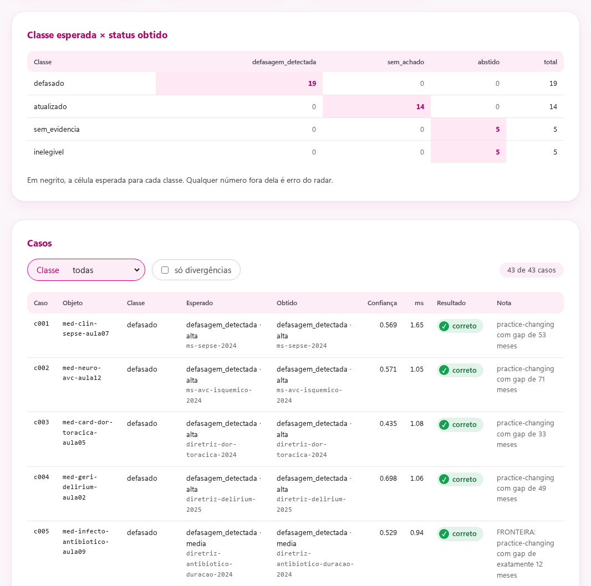
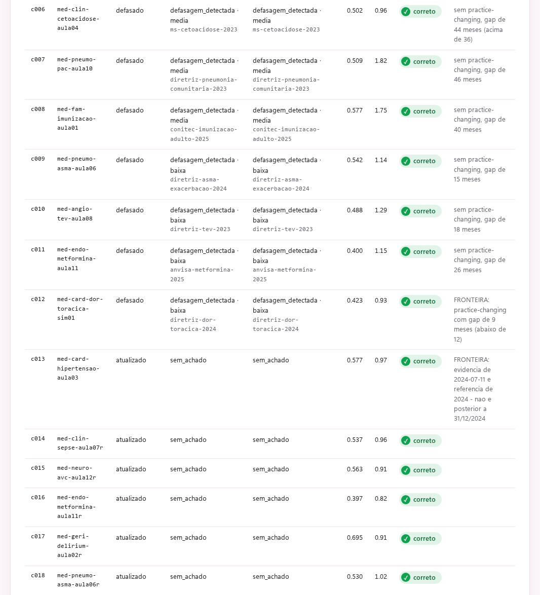

# Capturas

Todas as telas rodam sobre o corpus sintético do repositório. Voltar ao
[README](../README.md).

## 1. API em OpenAPI

A documentação interativa em `/docs`, com as rotas de análise, catálogo e
operação, incluindo `/v1/metricas`, `/v1/auditoria` e `/painel`.

## 2. Painel de avaliação

O resultado do `make eval`: metas duras cumpridas e build liberado, falso
alarme em 0% (0 de 10 materiais atualizados), a matriz classe esperada ×
status obtido com os 31 casos na diagonal (corpus da época das capturas) e a tabela caso a caso, incluindo
as fronteiras da tabela de severidade.

## 3. Painel de avaliação: casos-chave

As abstenções, com destaque para c026 e c027, os dois níveis do filtro de
proveniência: há evidência sobre o tema, mas só em fonte não validada, e o
radar se abstém em vez de alertar.

## 4. Radar do coordenador

Os contadores (31 objetos analisados, 12 com defasagem, 4 de cada severidade;
as capturas são de antes da ampliação do corpus para 43 objetos)
e a fila inteira, das defasagens altas às baixas, com o ano da referência que
cada material cita.
