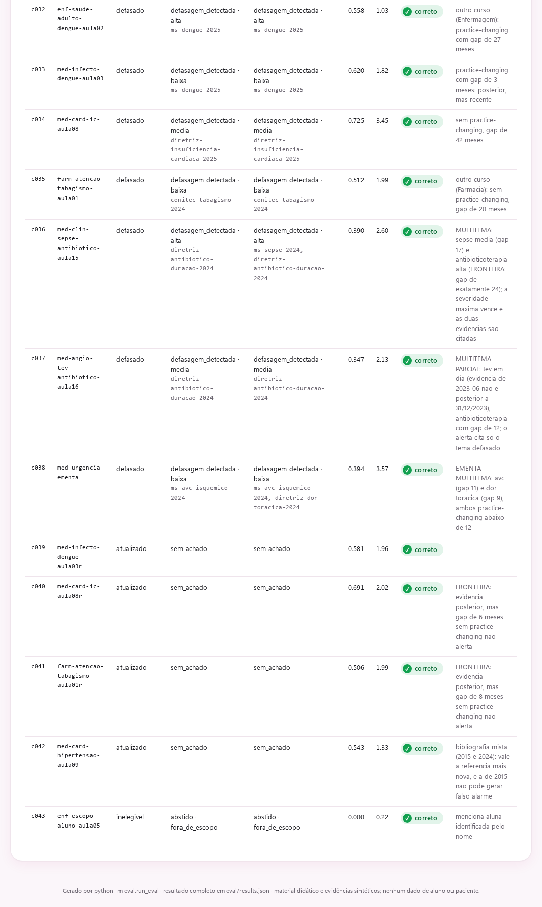

# Capturas

Todas as telas rodam sobre o corpus sintético do repositório. Voltar ao
[README](../README.md).

## 1. API em OpenAPI

A documentação interativa em `/docs`, com as rotas de análise, catálogo e
operação, incluindo `/v1/metricas`, `/v1/auditoria` e `/painel`.

## 2. Painel de avaliação

O resultado do `make eval`: metas duras cumpridas e build liberado, falso
alarme em 0% (0 de 14 materiais atualizados), a matriz classe esperada ×
status obtido com os 43 casos na diagonal e a tabela caso a caso, incluindo
as fronteiras da tabela de severidade.

## 3. Painel de avaliação: casos-chave

As abstenções, com destaque para c026 e c027, os dois níveis do filtro de
proveniência: há evidência sobre o tema, mas só em fonte não validada, e o
radar se abstém em vez de alertar.

## 4. Painel de avaliação: casos da ampliação

Os 12 casos acrescentados na ampliação do corpus: material de Enfermagem e
de Farmácia (c032, c035), objetos que tocam mais de um tema e respondem pela
severidade mais alta (c036 a c038), as fronteiras de gap sem
practice-changing que não alertam (c040, c041), uma bibliografia mista em que
a referência mais nova prevalece (c042) e um enunciado fora de escopo por
mencionar aluna identificada (c043).

## 5. Radar do coordenador

Os contadores (43 objetos analisados, 19 com defasagem: 6 altas, 6 médias e
7 baixas) e a fila inteira, das defasagens altas às baixas, com o ano da referência que
cada material cita.
