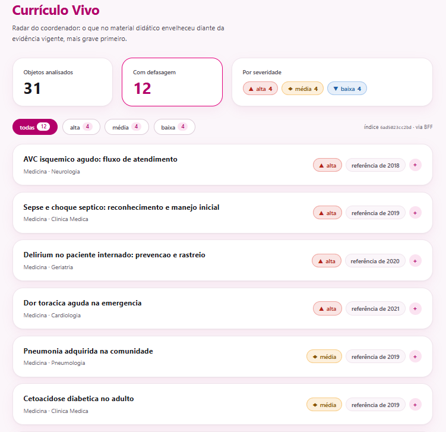
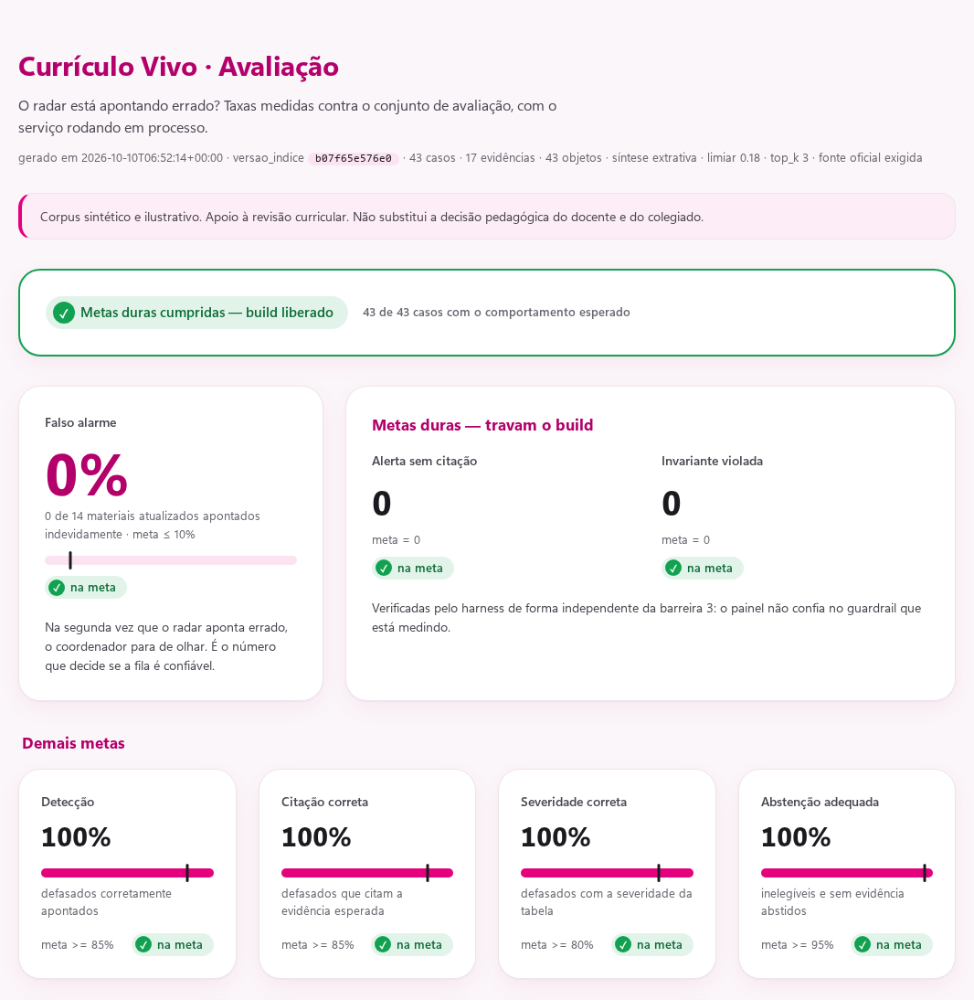

# Roteiro de apresentação (~10 min)

A ordem vai do problema ao produto, depois para a engenharia e por fim para a
prova de que funciona. A stack entra junto com o diagrama, que é onde a
pergunta "por que isso?" aparece naturalmente. Voltar ao
[README](../README.md).

---

## 0. Abertura, sem imagem (30 s)

> "Uma aula de sepse continua citando o protocolo de 2019 porque ninguém
> avisou que saiu atualização em 2024. Isso só aparece depois, como questão
> errada em simulado. Um LLM genérico não resolve, porque não diz de onde
> tirou a informação. E, para um coordenador, falso alarme custa mais que
> alerta perdido: enganado duas vezes, ele para de olhar."

**Frase-tese:** *"O sistema faz duas coisas: dá um alerta com citação
obrigatória ou se abstém explicitamente. Nunca dá um alerta sem fonte."*

---

## 1. `radar-1.png`, o produto (1 min 30)

Comece pelo que o usuário vê.

- **Contadores no topo:** 31 objetos analisados, 12 com defasagem, 4 de cada
  severidade.
- **Fila ordenada por severidade.** Aponte "AVC, alta, referência de 2018" e
  diga: *"O coordenador abre a tela e sabe por onde começar."*
- **Rodapé à direita (`índice 6ad5… · via BFF`):** *"Cada resposta diz qual
  versão do índice usou e por qual caminho veio. Isso vai importar daqui a
  pouco."*
- **Por que comparar datas, e não o conteúdo:** "sua aula cita 2019, existe
  2024" é verificável e defensável num colegiado. "O texto divergiu 0,72" não
  é.

> Avise logo: *"As capturas são de quando o corpus tinha 31 objetos. Hoje são
> 43, com o mesmo resultado."*

---

## 2. `curriculo-vivo.drawio.png`, arquitetura e stack (3 min)

Percorra o diagrama de cima para baixo, justificando cada peça:

| Peça | Por que essa escolha | O que se paga (diga em voz alta) |
| --- | --- | --- |
| **Next.js + React + TypeScript** (front) | Uma tela só, tipada contra o contrato da API. É a stack de front mais comum no mercado | Para uma tela, é mais do que o necessário. É prova de contrato ponta a ponta, não um produto de front |
| **NestJS** (BFF, opcional) | Fecha o desenho-alvo do PRD, em que o NestJS cuida do domínio (cursos, turmas). Aqui ele só agrega o radar | O front cai sozinho para o FastAPI se o BFF cair: *"derrubar o BFF no meio da demo não derruba o radar"* |
| **Python 3.12 + FastAPI** (núcleo) | O ecossistema de NLP e avaliação está no Python (scikit-learn, pytest). O FastAPI dá o OpenAPI de graça, com validação por Pydantic no contrato | (sem custo relevante) |
| **TF-IDF + cosseno**, sem embeddings nem banco vetorial | **Determinístico**: mesmo objeto, mesmo alerta, o que é requisito de auditoria. Custo zero e roda offline | Não entende sinônimos. A mitigação é o filtro por tema, e `Retriever.buscar` isola a troca futura |
| **Severidade por tabela**, sem score de modelo | O coordenador entende por que algo é "alto" | Fronteira rígida: 23 meses é média, 24 é alta |
| **LLM opcional** (justificativa extrativa por padrão) | A demo não depende de rede nem de chave. Se o LLM for ligado, o texto passa pela mesma barreira de validação | Texto menos fluido |
| **MongoDB** | Auditoria guarda um documento por análise, com o **hash** do material (não o texto) | Sem Mongo, cai para memória e a trilha some no restart |
| **Kafka + worker de ingestão** | Extrair documento é caro e variável. Fora do request, o p95 fica previsível. Commit manual de offset e idempotência por SHA-256 | Consistência eventual. Entrega at-least-once |
| **Docker / k8s** | Imagem única. Manifestos com HPA e readiness em `/health/ready` | **k8s não foi aplicado a nenhum cluster.** Diga isso antes que perguntem |

**Ponto alto:** *"Mongo e Kafka são opcionais. Sem eles a API sobe em
memória. Infra fora do ar degrada a observabilidade, não a análise."*

Se houver tempo, use o centro do diagrama, a caixa **ServicoAnalise**, para
mostrar as 4 barreiras: escopo → confiança e proveniência → validação do
achado → alertas. Cada barreira tem um motivo de abstenção próprio e testado.

---

## 3. `painel-1.png`, como sei que funciona (1 min 30)

- **Falso alarme em 0%** (0 de 10 materiais atualizados apontados). *"É o
  número que decide se a fila é confiável."*
- **Metas duras:** zero alertas sem citação e zero invariantes violadas. *"Se
  uma delas falhar, o build fica vermelho e a imagem Docker nem é construída,
  porque o `docker build` roda o eval."*
- *"O harness verifica as invariantes de forma independente do guardrail. O
  painel não confia no código que está medindo."*

**Honestidade, diga antes que perguntem:** *"100% não prova generalização. O
corpus foi calibrado para cobrir cada comportamento e as fronteiras. O eval
prova que o mecanismo faz o que promete. Com dados reais, o número a vigiar é
o falso alarme."*

---

## 4. `painel-4.png`, a decisão de produto mais importante (1 min)

Aponte a linha **c026**: material de 2017, artigo revisado por pares de 2025.
O resultado esperado é **abstenção**.

> "Um estudo primário isolado é hipótese, não consenso. O que muda currículo
> é diretriz e protocolo. Aceitar o último paper como gatilho seria construir
> exatamente a máquina de falso alarme que o produto existe para evitar."

O **c027** é o mesmo filtro aplicado a uma fonte não validada. Se der tempo,
mostre também o c030: o enunciado pede dose individualizada e cita paciente,
então o caso fica fora do escopo.

---

## 5. `api-openapi.png`, fechamento técnico (30 s)

*"Tudo o que vocês viram está exposto num contrato documentado: análise,
radar, auditoria, métricas e o próprio painel em `/painel`. A latência p95 é
de 3 ms, e o custo por análise é zero."*

---

## 6. Fechamento (30 s)

Limitações, ditas por você:

1. A API só enxerga evidência nova depois de reiniciar.
2. `defasagem.detectada` ainda não é publicado.
3. O índice fica em memória. Acima de ~100 mil trechos, entra um índice
   vetorial atrás da mesma interface.
4. Não há autenticação.

> "Cada decisão tem custo, e eu sei qual é o de cada uma."

---

## Dicas

- Imagens que podem ficar de reserva para perguntas: `painel-2` (a matriz com
  todos os casos na diagonal), `painel-3` e `radar-2`. Todas estão em
  [capturas.md](capturas.md).
- Para uma demo ao vivo no lugar das capturas, use `make demo`, que segue esse
  mesmo roteiro e roda sem a API no ar.
