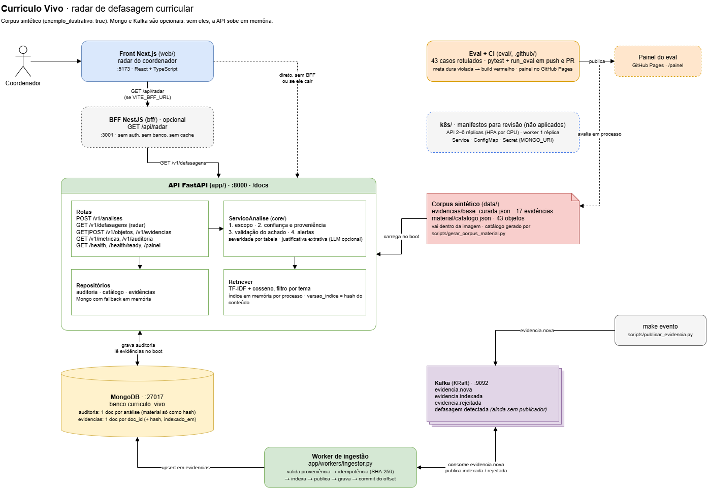

# System design do Currículo Vivo

Como o sistema foi desenhado e por quê: requisitos, componentes, fluxos,
dados, decisões e seus custos, escala, qualidade e limites. O diagrama está em
[`arquitetura.drawio`](arquitetura.drawio); a operação (portas, acesso ao
Mongo e ao Kafka) está em [`documentacao.md`](documentacao.md); o contrato
completo está no [PRD](../PRD.md).

## Sumário

1. [Problema e requisitos](#1-problema-e-requisitos)
2. [Componentes](#2-componentes)
3. [Os três fluxos](#3-os-três-fluxos)
4. [As quatro barreiras](#4-as-quatro-barreiras)
5. [Dados](#5-dados)
6. [Decisões e custos](#6-decisões-e-custos)
7. [Escala e disponibilidade](#7-escala-e-disponibilidade)
8. [Qualidade como portão de deploy](#8-qualidade-como-portão-de-deploy)
9. [Segurança e privacidade](#9-segurança-e-privacidade)
10. [Limitações e próximos passos](#10-limitações-e-próximos-passos)
11. [Perguntas frequentes](#11-perguntas-frequentes)

## 1. Problema e requisitos

O material didático de medicina envelhece sem ninguém perceber: uma aula
continua citando o protocolo de 2019 quando já saiu o de 2024.

**Funcionais**

- Para cada objeto de aprendizagem (aula, ementa, questão), dizer se existe
  evidência vigente mais nova que a referência que ele usa.
- Dar uma severidade ao achado e citar a fonte (órgão, URL, data, nível de
  evidência).
- Montar a fila do coordenador, ordenada por severidade: o radar.

**Não funcionais** (são eles que guiam o desenho)

| Requisito | Meta | Hoje |
| --- | --- | --- |
| Falso alarme (material atualizado apontado como defasado) | ≤ 10% | 0% |
| Alerta sem citação | = 0, meta dura | 0 |
| Determinismo: mesmo objeto, mesmo alerta | obrigatório | sim |
| Latência por análise | p95 < 500 ms | cerca de 3 ms |
| Subir sem Mongo, sem Kafka e sem chave de LLM | obrigatório | sim |

Falso alarme custa mais que alerta perdido: o coordenador enganado duas vezes
para de olhar. Por isso o sistema prefere se abster a chutar.

## 2. Componentes

| Componente | Responsabilidade | Tecnologia |
| --- | --- | --- |
| Front (`web/`) | Tela do radar do coordenador | Next.js + React + TypeScript |
| BFF (`bff/`), opcional | Repassa o radar para o front | NestJS |
| API (`app/`) | Análise, radar, catálogo, métricas, auditoria | FastAPI, Python 3.12 |
| Retriever | Encontrar a evidência do tema | TF-IDF + cosseno, em memória |
| MongoDB | Trilha de auditoria e evidências ingeridas | Mongo 7 |
| Kafka | Entrada assíncrona de evidência nova | Kafka 3.9, modo KRaft |
| Worker (`app/workers/ingestor.py`) | Validar, indexar e persistir evidência nova | Python |
| Eval + CI (`eval/`, `.github/`) | 43 casos rotulados que barram regressão | pytest + harness próprio, GitHub Actions |

O front funciona com ou sem o BFF: se o BFF cair, ele volta sozinho para a
API. Mongo e Kafka também são opcionais; sem eles a API sobe em memória.

## 3. Os três fluxos

### a) Análise de um objeto (síncrona)

`POST /v1/analises` → barreira 1 → busca por tema → barreira 2 → comparação
de datas → barreira 3 → barreira 4 → resposta → auditoria.

Tudo acontece em memória, sem chamada de rede no modo padrão, e por isso a
latência fica entre 1 e 3 ms.

### b) Radar (síncrono, em lote)

`GET /v1/defasagens` analisa o catálogo inteiro e ordena por severidade,
depois pelo maior gap, depois pelo `objeto_id` (para a ordem ser estável). As
análises são gravadas num lote só (`insert_many`) e marcadas com
`origem=radar`, para não distorcer a latência que o docente vê numa análise
avulsa (`/v1/metricas` filtra por origem).

### c) Ingestão de evidência nova (assíncrona)

Um produtor publica em `evidencia.nova` e o worker:

1. **Valida a proveniência.** Exige `fonte`, `fonte_tipo` e `publicado_em`
   explícitos, URL para fontes que podem sustentar alerta e data não futura.
   Reprovada → `evidencia.rejeitada`, com o motivo, e o offset avança para a
   mensagem ruim não travar a partição.
2. **Checa idempotência** pelo SHA-256 do conteúdo canônico. A mesma evidência
   reenviada é ignorada.
3. **Reindexa → publica `evidencia.indexada` → grava no Mongo → marca o hash
   → confirma o offset.**

A ordem do passo 3 é o que garante que nada se perde: se o processo cair no
meio, a mensagem é reentregue e reprocessada, em vez de ser tomada por
duplicata.

## 4. As quatro barreiras

| Barreira | Quando | Abstém ou descarta se… |
| --- | --- | --- |
| 1. Escopo | antes de buscar | não há conteúdo, não há referência com ano, o texto pede dose individualizada ou documento médico, ou menciona paciente ou aluno identificado |
| 2. Confiança e proveniência | depois de buscar | similaridade abaixo do limiar (0,18), ou só há fonte que não é órgão oficial nem diretriz de sociedade |
| 3. Validação do achado | antes de responder | o alerta não cita evidência existente, cita marcador inválido, ou a evidência não é posterior a 31/12 do ano da referência do material |
| 4. Alertas | junto da resposta | não bloqueia: anexa avisos (base ilustrativa, confiança no limiar, objeto sem revisão há 3 anos) |

Cada abstenção tem um motivo próprio e testado, e é isso que torna a saída
auditável. Se a barreira 3 descartar todos os achados, o status vira
`abstido` com `alerta_descartado`, nunca `sem_achado`: o descarte indica
regressão no gerador de justificativa e não pode aparecer como número
saudável.

### Tabela de severidade

Gap em meses de calendário entre dezembro do ano da referência mais nova do
material e o mês da evidência. Fronteiras fechadas à esquerda (`>=`).

| Evidência | Alta | Média | Baixa | Sem achado |
| --- | --- | --- | --- | --- |
| Practice-changing | ≥ 24 | 12 a 23 | 1 a 11 | não posterior |
| Sem practice-changing | nunca | ≥ 36 | 12 a 35 | < 12 |

Objeto com vários temas gera uma defasagem por tema, e vale a severidade
máxima. A regra mora em `RegraSeveridade` (`app/core/detector.py`) e os
limiares vêm de `Settings`: mudar um número é mudança de produto, versionada e
testada.

## 5. Dados

| Onde | O que guarda | Observações |
| --- | --- | --- |
| `data/evidencias/base_curada.json` | o que está vigente (17 evidências) | versionado e copiado para dentro da imagem |
| `data/material/catalogo.json` | objetos analisados (43) | gerado por `scripts/gerar_corpus_material.py`, determinístico |
| Mongo, coleção `auditoria` | um documento por análise | material só como hash; índices em `request_id` (único), `criado_em` e `(origem, criado_em)` |
| Mongo, coleção `evidencias` | evidências que chegaram pelo worker | um documento por `doc_id`, o conteúdo mais novo vence; guarda o hash para idempotência |
| Índice do retriever | trechos vetorizados | em memória, por processo; `versao_indice` é um hash do conteúdo |

No boot, a API monta o índice com a base curada mais as evidências do Mongo.
O hash do índice não depende da ordem de carga, então réplicas com a mesma
fonte têm a mesma `versao_indice`.

## 6. Decisões e custos

| # | Decisão | Em vez de | Por quê | O que se paga |
| --- | --- | --- | --- | --- |
| 1 | TF-IDF + cosseno | embeddings ou banco vetorial | determinístico, custo zero, sobe offline | não entende sinônimos; mitigado pelo filtro por tema, e `Retriever.buscar` isola a troca |
| 2 | Comparar datas de referência | diff semântico do conteúdo | "sua aula cita 2019, existe 2024" é verificável num colegiado | não pega material recente que ensina errado |
| 3 | Severidade por tabela | nota de modelo | o coordenador entende por que algo é alto | fronteira rígida: 23 meses é média, 24 é alta |
| 4 | Justificativa extrativa, LLM opcional | LLM sempre | sem rede e sem custo; com LLM, o texto passa pela mesma barreira 3 | texto menos fluido |
| 5 | Ingestão assíncrona por evento | ingestão no request | extrair documento é caro e variável; fora do request, o p95 fica previsível | consistência eventual |
| 6 | Quatro barreiras separadas | uma validação no fim | cada abstenção tem motivo próprio e auditável | mais código e mais caminhos a testar |
| 7 | Auditoria guarda hash do objeto | texto integral | reconstrói a análise sem duplicar conteúdo proprietário | para reler o material é preciso o catálogo versionado |
| 8 | Fallback em memória para Mongo e Kafka | falhar no boot | infra fora do ar degrada observabilidade, não a análise | em memória, a trilha some no restart |
| 9 | Commit manual de offset + idempotência | auto-commit | o offset só avança depois de indexar e publicar | entrega at-least-once: o consumidor precisa tolerar duplicata |

**A decisão de produto mais importante:** literatura revisada por pares não
dispara alerta sozinha. Um estudo primário isolado é hipótese, não consenso; o
que muda currículo é diretriz e protocolo. O caso `c026` do eval existe para
isso: material de 2017, artigo revisado de 2025, resultado esperado é
abstenção.

### Assimetria proposital nas falhas

| Falha | Na auditoria | No worker |
| --- | --- | --- |
| Mongo fora no boot | sobe em memória | sobe em memória |
| Mongo cai depois do boot | o registro vai para a reserva em memória e a análise segue | a exceção sobe, o offset não é confirmado e a mensagem é reentregue |

Perder um registro de auditoria degrada a observabilidade. Perder uma
evidência já confirmada degrada a base. Por isso as duas reagem diferente.

## 7. Escala e disponibilidade

- **API horizontal.** No k8s, de 2 a 6 réplicas com HPA por CPU (70%). Cada
  pod reconstrói o mesmo índice a partir da mesma fonte, então qualquer
  réplica dá a mesma resposta e o balanceador pode mandar a análise para
  qualquer uma.
- **Readiness e liveness separados.** `/health/ready` responde 503 com índice
  vazio, porque sem índice o serviço só sabe se abster: o pod sai do Service.
  `/health` não depende disso, para o kubelet não reiniciar em loop um pod
  que restart não conserta.
- **Divergência visível.** Um pod que sobe depois de uma ingestão carrega uma
  evidência a mais e fica com outra `versao_indice`. Ela aparece em
  `/health/ready`, no radar e em cada registro de auditoria. Até a API
  consumir `evidencia.indexada`, a saída é `kubectl rollout restart`.
- **Worker com 1 réplica.** Os tópicos têm 3 partições, então o consumo pode
  escalar até 3 workers no mesmo consumer group.
- **Teto do índice.** Ele é reconstruído inteiro a cada ingestão. Serve para
  centenas de documentos; acima de cerca de 100 mil trechos, o caminho é um
  índice vetorial gerenciado atrás da mesma interface.

## 8. Qualidade como portão de deploy

- `eval/dataset.json` tem 43 casos em quatro classes (defasado, atualizado,
  sem evidência, inelegível), incluindo as fronteiras de 12 e 24 meses,
  objetos com vários temas, bibliografia mista e os dois níveis do filtro de
  proveniência.
- O harness (`eval/run_eval.py`) verifica as invariantes por conta própria,
  sem confiar no guardrail que está medindo.
- **Metas duras:** `alerta_sem_citacao = 0` e `invariante_violada = 0`. Se
  uma falhar, o `run_eval` sai com código diferente de zero, a CI fica
  vermelha, o painel não é publicado e o `docker build` falha. Uma imagem
  que alerta sem fonte não chega a ser construída.
- **Ressalva:** 100% não prova generalização. O corpus foi calibrado de trás
  para frente a partir da tabela de severidade. O eval prova que o mecanismo
  faz o que promete; com dados reais, o número a vigiar é o falso alarme.

## 9. Segurança e privacidade

- Nenhum dado de aluno ou de paciente é recebido, processado ou armazenado. A
  barreira 1 recusa texto que identifique alguém.
- A auditoria guarda o material só como hash.
- Segredos (`MONGO_URI`, `ANTHROPIC_API_KEY`) ficam num Secret no k8s; em
  produção, vindos de um gerenciador de segredos, fora do Git.
- CORS restrito à origem do front e só para `GET`.
- **Fora do MVP:** autenticação e multi-tenancy. O Mongo do docker-compose não
  tem senha e serve só para desenvolvimento.

## 10. Limitações e próximos passos

| Limitação | Próximo passo |
| --- | --- |
| Evidência ingerida só vale depois de reiniciar a API | a API consumir `evidencia.indexada` e recarregar o índice |
| `defasagem.detectada` existe, mas ninguém publica | o radar emitir o evento quando um objeto passa a ficar defasado |
| A barreira 2 escolhe a evidência validada de maior similaridade, não a mais recente | escolher a mais recente entre as validadas acima do limiar, antes de a base ter mais de uma versão de um mesmo protocolo |
| Índice em memória reconstruído por inteiro | índice vetorial gerenciado atrás de `Retriever.buscar` |
| Sem autenticação nem multi-tenancy | auth no BFF e isolamento por instituição |
| Manifestos k8s nunca aplicados; sem OpenTelemetry | cluster real, Ingress, registry de imagem e tracing |

## 11. Perguntas frequentes

**Por que não usar um LLM direto?** Ele não diz de onde tirou a informação,
não é determinístico e custa por chamada. Aqui o LLM é opcional, só reescreve
a justificativa e passa pela mesma barreira 3 que o modo extrativo.

**E se o Mongo cair?** A análise continua respondendo e a auditoria vai para a
memória. No worker é o contrário: a falha sobe, o offset não é confirmado e a
mensagem volta. Veja a [assimetria proposital](#assimetria-proposital-nas-falhas).

**Como duas réplicas dão a mesma resposta?** Mesma fonte no boot gera a mesma
`versao_indice`, e o TF-IDF é determinístico. Se divergir, a versão exposta
no readiness, no radar e na auditoria mostra.

**Por que comparar datas e não conteúdo?** Porque é verificável e defensável
num colegiado. O custo está assumido na decisão 2.

**Como você sabe que funciona?** Eval com metas duras na CI, 231 testes e
invariantes verificadas de forma independente do guardrail.
